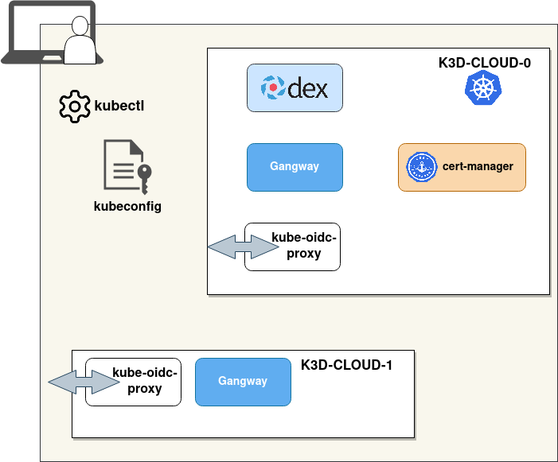

# Local demo

## Introduction

This documentation helps demonstrating how **kube-oidc-proxy** could be used in a cloud agnostic way.

Indeed, most of the Cloud Providers don't support OIDC settings on their managed Kubernetes offer.
As we're writing this documentation, this is possible on EKS for example.
In all other cases, adding kube-oidc-proxy in front of the Kubernetes API server can help having a consistent authentication process across all the cloud providers.

In this demo, we'll create **2 Kubernetes clusters** using [**k3d**](https://k3d.io/).
K3d leverages docker and k3s (lightweight Kubernetes flavor) and you should be able to run 2 instances locally.



Let's consider the following scenario:

| cluster name | API server             | Ingress controller     |
| ------------ | ---------------------- | ---------------------- |
| cloud-0      | https://localhost:6550 | https://localhost:6440 |
| cloud-1      | https://localhost:6551 | https://localhost:6441 |

* The cloud-0 cluster will host our OpenID provider: Dex
* We'll use cert-manager to easily provision self-signed certificates.

## Requirements

* Basic Kubernetes knowledge, though we'll focus on [authentication](https://kubernetes.io/docs/reference/access-authn-authz/authentication/) and [RBAC](https://kubernetes.io/docs/reference/access-authn-authz/rbac/)
* Docker must be up and running
* [k3d](https://k3d.io/#installation)
* [helm](https://helm.sh/docs/intro/install/) >v3.x.x

## Create k3d clusters

For this demo you should initiate a **new KUBECONFIG**

```console
$ export KUBECONFIG=${HOME}/demo-kubeconfig
```

Create 2 clusters `cloud-0` and `cloud-1`

```console
$ for ID in {0..1};do
  k3d cluster create cloud-"${ID}" --api-port 655"${ID}" -p "644${ID}:80@loadbalancer"
done
...
INFO[0027] Cluster 'cloud-1' created successfully!
INFO[0027] You can now use it like this:
kubectl cluster-info
```

The commands above will also allows to reach the API servers and ingress controllers.

Check that the clusters are running properly

```console
$ k3d cluster list
NAME         SERVERS   AGENTS   LOADBALANCER
cloud-0      1/1       0/0      true
cloud-1      1/1       0/0      true

$ kubectl config get-contexts
CURRENT   NAME          CLUSTER       AUTHINFO            NAMESPACE
          k3d-cloud-0   k3d-cloud-0   admin@k3d-cloud-0
*         k3d-cloud-1   k3d-cloud-1   admin@k3d-cloud-1
```

Your API servers and the ingress controllers should be reachable

```console
# API servers
$ for ID in {0..1};do kubectl cluster-info --context=k3d-cloud-${ID};done

# Ingress controllers
$ for ID in {0..1}; do curl http://localhost:644${ID}/ping; done
```

## Self-signed certificates using cert-manager

Switch to the `k3d-cloud-0` cluster context

```console
$ kubectl config use-context k3d-cloud-0
Switched to context "k3d-cloud-0".
```

### Install cert-manager using Helm

Install using Helm cert-manager with the default values. For more info please check the [artifact.io page](https://artifacthub.io/packages/helm/jetstack/cert-manager).
First of all we'll install the CRD's then we'll run the install command:

```console
$ kubectl apply -f https://github.com/jetstack/cert-manager/releases/download/v1.2.0/cert-manager.crds.yaml
...
customresourcedefinition.apiextensions.k8s.io/orders.acme.cert-manager.io created
```

```console
# Add the Jetstack Helm repository
$ helm repo add jetstack https://charts.jetstack.io
"jetstack" has been added to your repositories

# Install the cert-manager helm chart
$ helm install cert-manager --create-namespace --namespace cert-manager jetstack/cert-manager
...
cert-manager has been deployed successfully!
...
```

Check that the pods are running properly

```console
$ kubectl get po -n cert-manager
NAME                                       READY   STATUS    RESTARTS   AGE
cert-manager-cainjector-74459fcc56-g8hnp   1/1     Running   0          47s
cert-manager-85f9bbcd97-klg5p              1/1     Running   0          47s
cert-manager-webhook-57d97ccc67-9vf54      1/1     Running   0          47s

```

### Generate self-signed certificates

Our components will be installed in a namespace named `auth`. Let's create it

```console
$ kubectl create ns auth
namespace/auth created
```

```console
kubectl apply -f manifests/cert-manager -n auth
certificate.cert-manager.io/demo-ca created
clusterissuer.cert-manager.io/demo-selfsigned created
certificate.cert-manager.io/dex created
issuer.cert-manager.io/demo-ca-issuer created
```

```console
$ kubectl get cert -n auth
NAME      READY   SECRET        AGE
demo-ca   True    demo-ca-tls   15m
dex       True    dex-tls       5s
```

## Deploy Dex

```console
helm repo add dex https://charts.dexidp.io
"dex" has been added to your repositories
```

## Configuring the domain names


## Testing everything